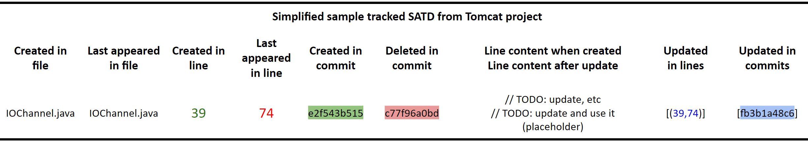

# SATD Tracker

SATD Tracker is a tool that extracts Self Admitted Technical Debts (SATDs) from a Git repository and saves them into a CSV file. It uses the following three steps to track SATDs:

- Step 1: Collect all file hunks for all commits in the master branch
- Step 2: Identify and track *raw SATDs* from commit-file hunks. In this step, we extract all SATD creation and deletion actions, while some pairs of deletion/creation which occurred in the same file and commit are "SATD update action" rather "resolving a SATD and creating another SATD". We refer to these pairs as *false positives*.
- Step 3: Detect false positive SATD deletion/creation actions in raw SATDs and convert them to SATD <span style="color:blue">update</span> actions.

The following figure shows the lifecycle of a sample SATD from the Apache-Tomcat project. This SATD is created in commit <span style="color:green">e2f5443b515</span>, then updated in commit <span style="color:blue">fb3b1a48c6</span>, and finally deleted in commit <span style="color:red">c77f96a0bd</span>. Note that in commit <span style="color:blue">fb3b1a48c6</span>, there is a false positive SATD deltion (line 39) and a false positive SATD creation (line 74) that we convert them to SATD update action in step 3.


The following table shows the information about this SATD that is extracted by our tool.




## Features

This tool identifies and tracks self-admitted technical debts (SATDs) in various programming languages, including C/C++, C#, Java, Python, PHP, JavaScript, Ruby, Swift, Kotlin, R, MATLAB, SQL, Scala, Perl, and Rust. To support additional programming languages, you can easily update the `get_single_line_comment()` method to handle the comment syntax of the new language and add the corresponding file extension to the list of file extensions in the `get_project_SATDs()` function.

For each extracted SATD, the tool reports the following information:

- created_in_file: The file path which the SATD created in.
- last_appeared_in_file: The file path which the SATD appeared in for the last time before it was deleted or if we traced it to the last commit.
- created_in_line: The SATD line number when it was created.
- last_appeared_in_line: The SATD line number when it appeared for the last time.
- created_in_commit: The commit in which the SATD was created in.
- deleted_in_commit: The commit in which the SATD was deleted in.
- created_at_date: The date-time of the commit that the SATD was created in.
- deleted_at_date: The date-time of the commit that the SATD was deleted in.
- content: The whole line content in which we detect the SATD in.

In case a SATD line is updated in one or more commits, we also provide:

- deleted_in_lines
- created_in_lines
- updated_in_commits

## Update

We made an update to the tool after presenting it in the conference. To improve performance, we eliminated the usage of vcsSHARK tool and used our own code to explore the Git repository and extract the required information.

## Usage

1. Install the python packages listed in the requirements.txt:

```
pip install -r requirements.txt
```

2. Run the following command to extract the SATDs from a repository:

```
python SATD_Tracker.py --repo https://github.com/apache/commons-math.git
```

### Parameters

```
usage: SATD_Tracker.py [-h] [--repo REPO] [--file-extensions FILE_EXTENSIONS]
                       [--output-file OUTPUT_FILE] [--output-path OUTPUT_PATH]
                       [--provide-raw-SATD] [--downloading-path DOWNLOADING_PATH]
                       [--delete-downloaded-repo]

SATD-Tracker parameters

options:
  -h, --help            show this help message and exit
  --repo REPO           Repository path (local directory or GitHub URL) [default:
                        https://github.com/apache/commons-math.git]
  --file-extensions FILE_EXTENSIONS
                        File extensions, for example: py,java,cpp. [default: py, php, rb, sql, pl,
                        r, java, js, c, cpp, h, cs, swift, go, kt, kts, scala, rs, m]
  --output-file OUTPUT_FILE
                        Output file [default: username___reponame_SATD.csv or
                        directoryname_SATD.csv]
  --output-path OUTPUT_PATH
                        Output path [default: SATD/]
  --provide-raw-SATD    In addition to the final list of SATD, also provide raw SATD [default:
                        False]
  --downloading-path DOWNLOADING_PATH
                        Downloading path for GitHub repositories [default: repositories/]
  --delete-downloaded-repo
                        Delete downloaded repository after extracting SATDs [default: False]
```

## Citation

If you use this tool in your research, please cite our paper:

```
@inproceedings{SATD-Tracker,
   title={Automated Self-Admitted Technical Debt Tracking at Commit-Level: A Language-independent Approach},
   author={Mohammad Sadegh Sheikhaei, Yuan Tian},
   booktitle={Proceedings of the TechDebt 2023 conference},
   year={2023}
}
```
